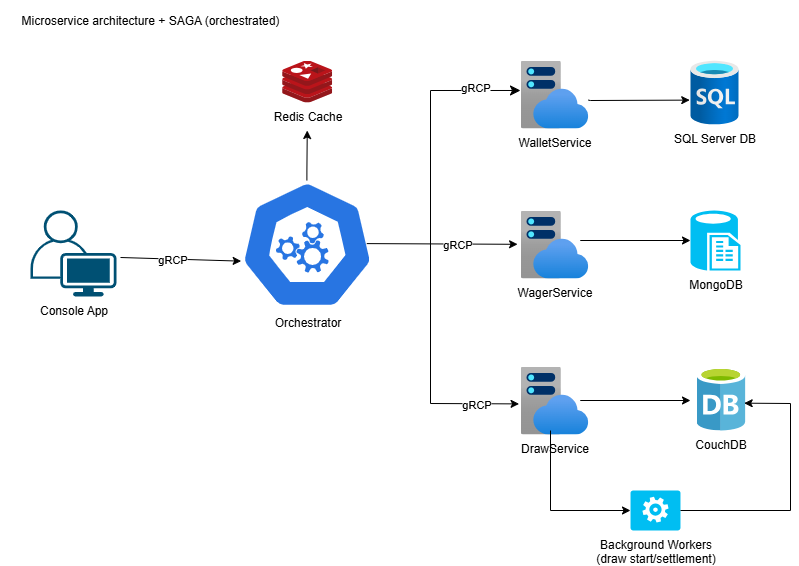
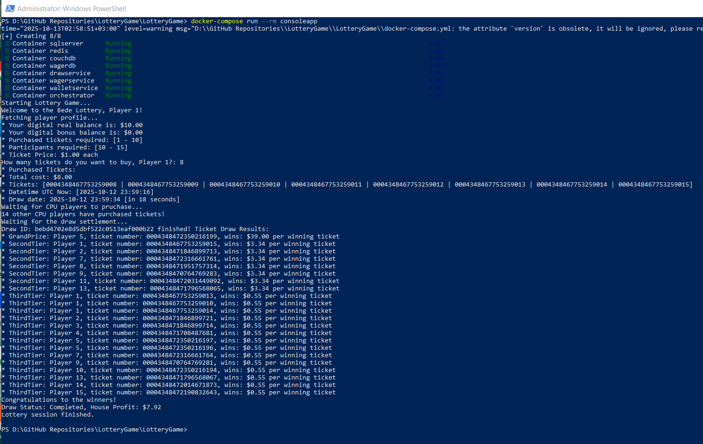
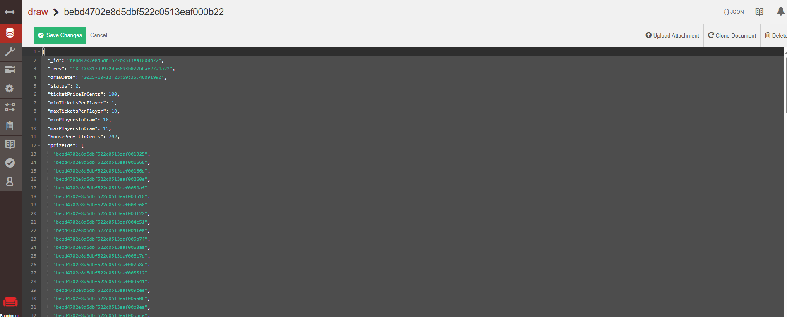
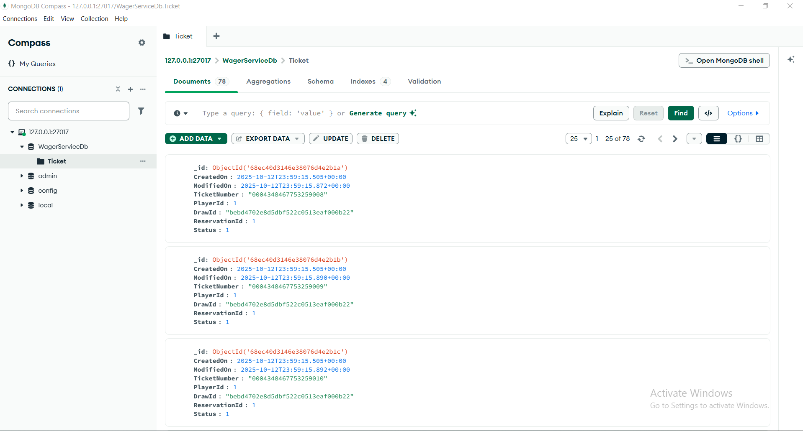
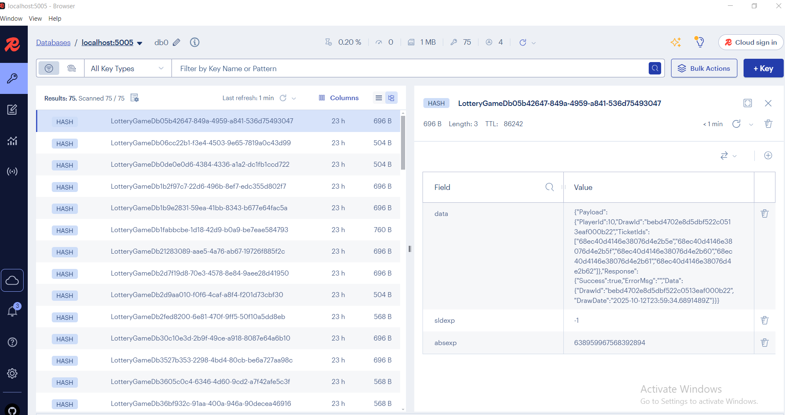

# LotteryGame

Practical assignment from Bede Gaming for the role of .NET Developer

A lottery game implemented as microservices with a SAGA orchestrator, where a human player and CPU players buy tickets, and winners are drawn randomly across three prize tiers: grand prize (50% of revenue), second tier (30% shared among 10% of tickets), and third tier (10% shared among 20% of tickets)



## Technologies

* Microservice Architecture
* SAGA orchestration pattern
* gRPC for service-to-service calls
* Snowflake algorithm for unique ticket numbers
* SQL Server
* Entity Framework Core
* MongoDB
* CouchDB
* Redis
* Docker Compose
* Automapper
* NUnit

### Docker Images: 

[https://hub.docker.com/r/itplamen/operativeservice/tags](https://hub.docker.com/r/itplamen/consoleapp) <br />
[https://hub.docker.com/r/itplamen/userdataservice/tags](https://hub.docker.com/r/itplamen/orchestrator) <br />
[https://hub.docker.com/r/itplamen/drawservice-workers](https://hub.docker.com/r/itplamen/drawservice-workers) <br />
[https://hub.docker.com/r/itplamen/drawservice](https://hub.docker.com/r/itplamen/drawservice) <br />
[https://hub.docker.com/r/itplamen/wagerservice](https://hub.docker.com/r/itplamen/wagerservice) <br />
[https://hub.docker.com/r/itplamen/walletservice](https://hub.docker.com/r/itplamen/walletservice)

```bash
docker-compose build --no-cache

# Check status
[+] Building 284.0s (105/105) FINISHED
[+] Building 6/6
 ✔ lotterygame-orchestrator.api     Built                                                                          0.0s
 ✔ lotterygame-consoleapp           Built                                                                          0.0s
...
...
```
```bash
docker-compose up -d sqlserver mongo couchdb walletservice.api wagerservice.api drawservice.api drawservice.workers redis orchestrator.api

# Check status
 ✔ Network lotterygame_backend          Created                                                                    0.1s
 ✔ Volume "lotterygame_mongo_data"      Created                                                                    0.0s
...
...
```
```bash
docker logs -f walletservice

# Check for applied migrations
Applying migrations...
info: Microsoft.EntityFrameworkCore.Database.Command[20101]
      Executed DbCommand (683ms) [Parameters=[], CommandType='Text', CommandTimeout='60']
      CREATE DATABASE [WalletServiceDb];
...
...
Migrations successfully applied!
```
```bash
# Check logs
docker logs -f wagerservice
docker logs -f drawservice
docker logs -f drawservice.workers
docker logs -f orchestrator
...
...
```
```bash
docker-compose run --rm consoleapp
```


## Databases
#### CouchDB:  http://localhost:5984/_utils/#login admin/admin


#### MongoDB (Compass): mongodb://127.0.0.1:27017/


#### Redis

